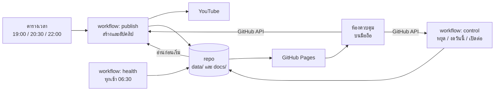
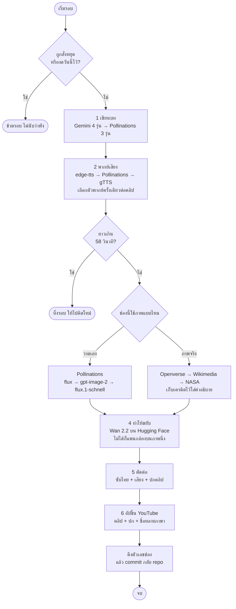
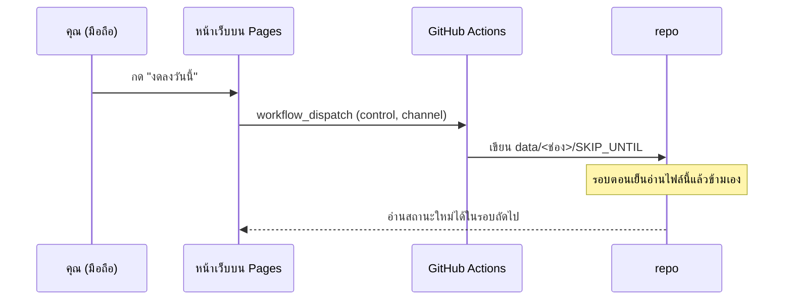

# ระบบทำงานยังไง

เอกสารนี้อธิบายว่าคลิปหนึ่งคลิปเกิดขึ้นได้ยังไงตั้งแต่ไม่มีอะไรเลยจนขึ้นช่อง
และใครเป็นคนสั่งให้มันเริ่ม ตอนที่ไม่มีใครนั่งอยู่หน้าคอม

---

## 1. ภาพรวม

ระบบไม่มีเซิร์ฟเวอร์ของตัวเอง ทุกอย่างเกิดบนเครื่องของ GitHub ที่ยืมมาใช้
วันละไม่กี่นาที แล้วเขียนผลลัพธ์กลับเข้า repo เป็นไฟล์ json
หน้าเว็บคือไฟล์นิ่งที่อ่าน json พวกนั้น จึงเปิดดูได้ตลอดแม้คอมที่บ้านปิดอยู่



จุดที่ต้องเข้าใจ: **repo เป็นทั้งโค้ดและฐานข้อมูล** ผลของทุกรอบถูก commit
กลับเข้ามา ทำให้มีประวัติย้อนหลังโดยไม่ต้องมีฐานข้อมูลจริง และไม่มีค่าใช้จ่าย

---

## 2. วงจรผลิตคลิป 6 ขั้น



### แต่ละขั้นทำอะไร

| ขั้น | ไฟล์ | สิ่งที่เกิดขึ้น |
|---|---|---|
| 1 | `steps/script.py` | ส่งโจทย์ของช่อง (`channels/<ช่อง>/prompt.txt`) ไปให้ AI พร้อมรายการเรื่องที่เคยทำ (กันซ้ำ) และชื่อคลิปที่ทำผลงานดีที่สุด (ให้เรียนรู้) |
| 2 | `steps/voice.py` | พากย์ทั้งคลิปรวดเดียวด้วยตัวพากย์เดียว แล้ววัดจังหวะรายคำเพื่อทำซับ |
| 3 | `steps/images.py` หรือ `steps/stock.py` | ขึ้นกับ `images.source` ใน config ของช่อง |
| 4 | `steps/animate.py` | ขอ GPU ฟรีจาก Hugging Face ทีละฉาก ฉากที่ไม่ได้คิวจะใช้การแพนกล้องแทน |
| 5 | `steps/render.py`, `subtitles.py`, `thumbnail.py` | ซับไทยใช้ libass เพราะวางสระและวรรณยุกต์ถูก ปกใช้ภาพฉากแรกซึ่งเป็นฉากฮุก |
| 6 | `steps/upload.py` | อัปคลิป ตั้งปก ใส่ชื่อหลายภาษา และแนบเครดิตภาพถ้ามี |

---

## 3. หลักการที่ระบบยึด

### ยอมได้คลิปที่ดีน้อยลง ดีกว่าไม่ได้คลิป

เกือบทุกขั้นมีตัวสำรองเรียงไว้หลายชั้น ถ้าตัวแรกล่มจะไหลไปตัวถัดไปเอง
ไม่ใช่หยุดทั้งรอบ เพราะช่องที่หายไปหนึ่งวันเสียมากกว่าคลิปที่คุณภาพลดลงหน่อย

ข้อยกเว้นมีข้อเดียว — **บทที่ยาวเกิน 58 วินาทีจะถูกทิ้ง** ไม่ตัดให้สั้นลง
เพราะคลิปที่ถูกตัดกลางเรื่องแย่กว่าไม่มีคลิป

### ลงได้วันละคลิปเดียวต่อช่อง

ตารางเวลาตั้งไว้สามเวลาเพราะ cron ของ GitHub บน repo ฟรีเป็นแบบ best-effort
บางรอบมาช้าเป็นชั่วโมง บางรอบหายไปเลย รอบแรกที่ทำสำเร็จจะได้คลิป
ที่เหลือเห็นว่าวันนี้มีแล้วก็ข้ามเอง

### ช่องหนึ่งล้มต้องไม่ลากอีกช่องลงไปด้วย

แต่ละช่องเป็นงานแยกกันใน matrix ตั้ง `fail-fast: false` ไว้
แต่ทำ**ทีละช่อง** ไม่พร้อมกัน เพราะทุกช่องแบ่งโควตา GPU ก้อนเดียวกัน

---

## 4. โครงไฟล์

```
channels/<ช่อง>/config.yaml       ตั้งค่าทั้งหมดของช่องนั้น
channels/<ช่อง>/prompt.txt        โจทย์การเขียน — บรรณาธิการตัวจริงของช่อง
channels/<ช่อง>/config.local.yaml ค่าที่แก้จากห้องควบคุม (ทับ config.yaml)

data/<ช่อง>/history.json          เรื่องที่เคยทำ ใช้กันพล็อตซ้ำ
data/<ช่อง>/PAUSED                มีไฟล์นี้ = หยุดจนกว่าจะสั่งเปิด
data/<ช่อง>/SKIP_UNTIL            วันที่ที่สั่งงดไว้

docs/<ช่อง>/channel.json          ยอดซับ ยอดวิว สถิติรายคลิป
docs/<ช่อง>/growth.json           จดตัวเลขวันละแถว ใช้วาดกราฟการเติบโต
docs/<ช่อง>/status.json           ประวัติรอบทำงาน
docs/<ช่อง>/health.json           ผลตรวจบริการล่าสุด
docs/channels.json                รายชื่อช่องและช่องไหนเปิดอยู่
```

`config.yaml` เป็นไฟล์เดียวที่คนเขียน ทุกไฟล์ที่เหลือระบบเขียนเอง
ห้องควบคุมเขียนลง `config.local.yaml` แทนที่จะแก้ `config.yaml` โดยตรง
เพราะ PyYAML เขียนกลับแล้วคอมเมนต์อธิบายทั้งหมดจะหายไป

---

## 5. ความลับอยู่ที่ไหน

ไม่มีค่าลับอยู่ใน repo เลย ทั้งหมดอยู่ใน GitHub Secrets และใน `.env`
บนเครื่องตัวเองซึ่งไม่ถูกอัปขึ้น

เวลาหาค่า ระบบจะหาตัวที่ลงท้ายด้วยชื่อช่องก่อน ไม่เจอค่อยใช้ตัวกลาง

```
YT_REFRESH_TOKEN_WORLD   →  ถ้าไม่มี  →  YT_REFRESH_TOKEN
```

แปลว่าโทเค็น YouTube ต้องแยกต่อช่อง (เพราะคนละช่องจริง ๆ)
แต่คีย์ Gemini กับ Pollinations ใช้ตัวกลางร่วมกันได้ทุกช่อง
เพิ่มช่องใหม่จึงตั้ง secret แค่ 3 ตัว ไม่ใช่ทั้งชุด

---

## 6. สั่งงานจากห้องควบคุม

หน้าเว็บเป็นไฟล์นิ่ง ไม่มีเซิร์ฟเวอร์ ปุ่มสั่งงานจึงเรียก GitHub API ตรงจาก
เบราว์เซอร์ด้วยโทเค็นของเจ้าของ repo ที่เก็บไว้ใน localStorage ของเครื่องนั้น



ถ้าไม่ใส่โทเค็น หน้าเว็บยังดูได้ครบทุกอย่าง แค่กดปุ่มไม่ได้

---

## 7. ข้อจำกัดที่รู้ตัว

| เรื่อง | ความจริง |
|---|---|
| ตารางเวลา | cron ของ repo ฟรีไม่รับประกันเวลา ตั้งสามรอบเป็นตาข่ายรองแล้ว แต่ยังมีโอกาสหลุดทั้งวัน |
| โควตา GPU | Hugging Face ให้ราว 544 วินาทีต่อวัน **ต่อบัญชี ไม่ใช่ต่อช่อง** หนึ่งคลิปที่ขยับครบ 6 ฉากใช้ราว 330 วินาที จึงมีได้ช่องเดียวที่ขยับทุกฉาก |
| โควตา YouTube | 10,000 หน่วยต่อวันต่อโปรเจกต์ อัปโหลดกินครั้งละ 1,600 เพิ่มได้ถึง 6 ช่องก่อนต้องขอเพิ่ม |
| คุณภาพภาพจากคลังเสรี | ประมาณ 4 ใน 5 ใบใช้ได้ ที่เหลือหลุดธีม เพดานของคลังที่ไม่ต้องใช้คีย์ |
| สถิติเชิงลึก | ยังไม่มีสิทธิ์ Analytics จึงไม่เห็นอัตราคนดูจบและที่มาของคนดู ซึ่งเป็นตัวชี้ขาดของ Shorts |

---

## 8. เพิ่มช่องใหม่ต้องทำอะไร

1. สร้างโฟลเดอร์ `channels/<ชื่อ>/` ใส่ `config.yaml` กับ `prompt.txt`
2. ตั้ง `run.enabled: false` ไว้ก่อน
3. สร้างช่องบน YouTube แล้วยืนยันเบอร์ที่ช่องนั้น (ไม่งั้นใส่ปกเองไม่ได้)
4. `python tools/get_refresh_token.py --channel <ชื่อ>` แล้ว**ดูให้แน่ว่าได้ช่องถูกตัว**
5. ใส่ secret 3 ตัวที่ลงท้ายด้วยชื่อช่องตัวพิมพ์ใหญ่
6. ทดลองรันเจาะจงช่องนั้นหนึ่งรอบ ดูผลจริงก่อน
7. เปลี่ยนเป็น `run.enabled: true`

ไม่ต้องแตะ workflow เลย เพราะมันถามโค้ดเองว่ามีช่องไหนเปิดอยู่
